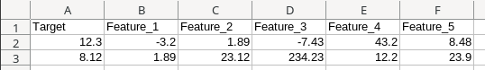
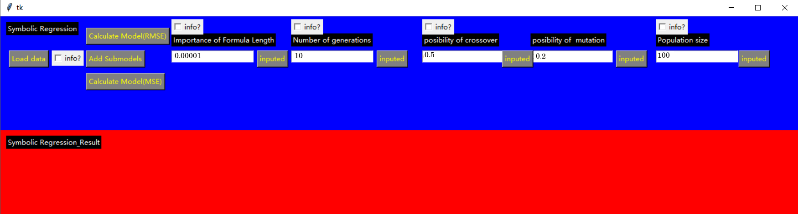
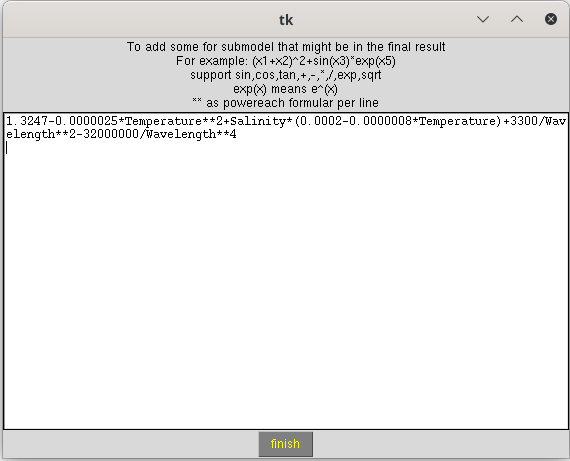
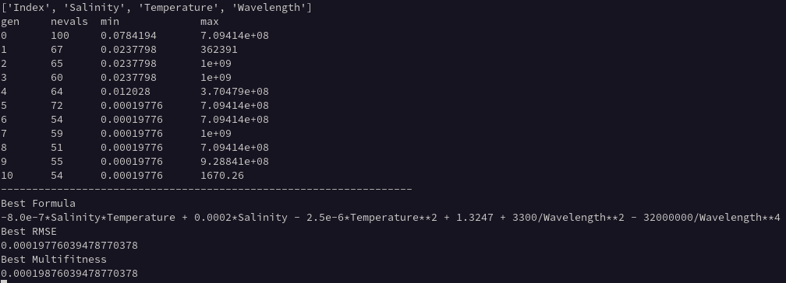
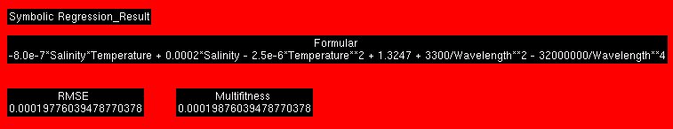

# Symbolic Regression <!-- omit in toc -->

This is the code and the data set necessary to reproduce the results from the the dissertation "Modellbildung mittels Symbolischer Regression zur Messunsicherheitsbestimmung komplexer Messprozesse". 

Author: Mueller, Tobias 

Chair of Production Metrology and Quality Management at the Laboratory for Machine Tools and Production Engineering (WZL) of RWTH Aachen University - Campus Boulevard 30, 52074 Aachen, Germany

Please cite this code or the data set as: BibTex will be added after publication

A symbolic regression is an algorithm for fitting analytic relationships between features $`\bm{x}`$ and targets $`y`$ based on training data. This repository contains an implementation of a symbolic regression in Python with a GUI. The implementation is based on the DEAP library, see https://deap.readthedocs.io/en/master/.

# Table of Contents <!-- omit in toc -->
- [Installation](#installation)
- [Supported Data Format](#supported-data-format)
- [Usage](#usage)
- [Example: CT Scan](#example-ct-scan)
- [Example: Ultrasound](#example-ultrasound)
- [License](#license)

# Installation 

To run this implementation of a symbolic regression, a Python interpreter is required. While this code was optimized for Python 3.8,  most likely other versions of Python 3 will also work. The code is reported to work on Windows and Linux. 

In addition to a Python interpreter, the packages in "requirements.txt" are needed. They can be installed automatically with the Python package-manager pip by running the command `pip install -r requirements.txt` in the directory of the local clone of this repository.

# Supported Data Format

The data has to be an ".xls" file with **exactly one spreadsheet with the name "Sheet1"** of the following form:

The first row is a header that describes the content of each column. The first column contains the target values for every measurement, while the other columns are the corresponding features.

As comma separator, a "." ("dot", e.g. 12.3) has to be used.

# Usage

A typical run of the symbolic regression looks like this:

1. Run main.py, e.g. via the command `python main.py`.
2. If the Python script started successfully, the following window pops up: 
3. Click on "Load data" to select data that fulfills the requirements described in the section [Supported Data Format](#supported-data-format).
4. The text fields may be used to specify the hyperparameters of the symbolic regression. Otherwise, the standard settings are applied. For more information on the hyperparameters, click on "info?". 
5. Each specified hyperparameter has to be accepted by a click on the arrow button next to the text field. If the hyperparameter has been set successfully, the text "inputed" will replace the arrow symbol: 
6. If it is desired to specify submodels to consider during the symbolic regression, click on "Add Submodels". In the window that pops up, submodels can be written. They have to be accepted by clicking on "finish": 
7. Click on "Calculate Model(RMSE)" or "Calculate Model(MSE)" depending on if you are interested in the RMSE or the MSE of the model.
8. During the symbolic regression, the minimum and maximum RMSE/MAE for every generation is printed in the terminal. When the symbolic regression has finished, the final formula and its RMSE/MAE is also displayed:  The same information appears also in the GUI: 

# Example: CT Scan

Under "example_ct_scan/rmse_vs_generation.xls", the results of a symbolic regression on the CT scan dataset after the feature selection (see https://git-ce.rwth-aachen.de/wzl-mq-ms-rpc/code/research/mlb-dissertation/feature-selection-for-measurement-models) are stored. The file contains the minimum RMSE as a function of the generation number. The hyperparameters that were found with the HPO algorithm "Bayesian Optimization via TPE" as well as the final formula are also denoted in the file.

# Example: Ultrasound

The results of a symbolic regression on the ultrasound dataset after the feature selection (see https://git-ce.rwth-aachen.de/wzl-mq-ms-rpc/code/research/mlb-dissertation/feature-selection-for-measurement-models) are stored under "example_ultrasound/rmse_vs_generation.xls". The content of the file is analog to the the CT scan example in the last section.

# License

Copyright 2022 Tobias Mueller - RWTH Aachen Univerity - Laboratory for Machine Tools and Production Engineering WZL of RWTH Aachen

Redistribution and use in source and binary forms, with or without modification, are permitted provided that the following conditions are met:

1. Redistributions of source code must retain the above copyright notice, this list of conditions and the following disclaimer.
2. Redistributions in binary form must reproduce the above copyright notice, this list of conditions and the following disclaimer in the documentation and/or other materials provided with the distribution.
3. Neither the name of the copyright holder nor the names of its contributors may be used to endorse or promote products derived from this software without specific prior written permission.

THIS SOFTWARE IS PROVIDED BY THE COPYRIGHT HOLDERS AND CONTRIBUTORS "AS IS" AND ANY EXPRESS OR IMPLIED WARRANTIES, INCLUDING, BUT NOT LIMITED TO, THE IMPLIED WARRANTIES OF MERCHANTABILITY AND FITNESS FOR A PARTICULAR PURPOSE ARE DISCLAIMED. IN NO EVENT SHALL THE COPYRIGHT HOLDER OR CONTRIBUTORS BE LIABLE FOR ANY DIRECT, INDIRECT, INCIDENTAL, SPECIAL, EXEMPLARY, OR CONSEQUENTIAL DAMAGES (INCLUDING, BUT NOT LIMITED TO, PROCUREMENT OF SUBSTITUTE GOODS OR SERVICES; LOSS OF USE, DATA, OR PROFITS; OR BUSINESS INTERRUPTION) HOWEVER CAUSED AND ON ANY THEORY OF LIABILITY, WHETHER IN CONTRACT, STRICT LIABILITY, OR TORT (INCLUDING NEGLIGENCE OR OTHERWISE) ARISING IN ANY WAY OUT OF THE USE OF THIS SOFTWARE, EVEN IF ADVISED OF THE POSSIBILITY OF SUCH DAMAGE.
