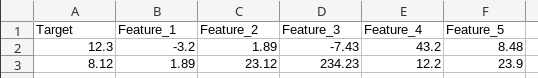
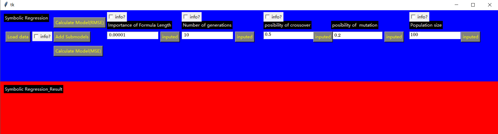
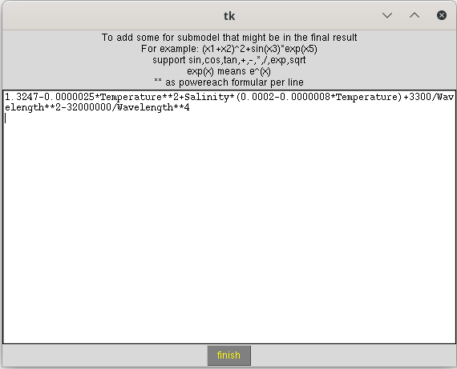
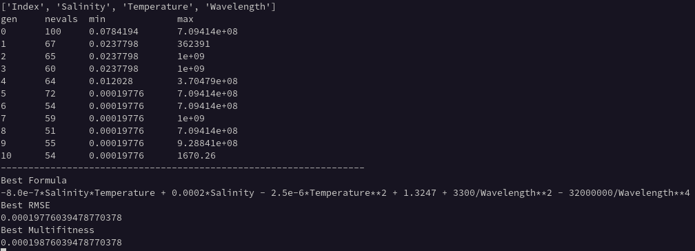
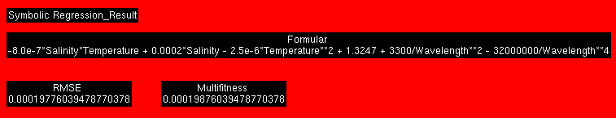

# Symbolic Regression <!-- omit in toc -->

A symbolic regression is an algorithm for fitting analytic relationships between features $`\bm{x}`$ and targets $`y`$ based on training data. This repository contains an implementation of a symbolic regression in Python with a GUI. The implementation is based on the DEAP library, see https://deap.readthedocs.io/en/master/.

# Table of Contents <!-- omit in toc -->
- [Installation](#installation)
- [Supported Data Format](#supported-data-format)
- [Usage](#usage)

# Installation 

To run this implementation of a symbolic regression, a Python interpreter is required. While this code was optimized for Python 3.8,  most likely other versions of Python 3 will also work. The code is reported to work on Windows and Linux. 

In addition to a Python interpreter, the packages in "requirements.txt" are needed. They can be installed automatically with the Python package-manager pip by running the command `pip install -r requirements.txt` in the directory of the local clone of this repository.

# Supported Data Format

The data has to be an ".xls" file with **exactly one spreadsheet with the name "Sheet1"** of the following form:

The first row is a header that describes the content of each column. The first column contains the target values for every measurement, while the other columns are the corresponding features.

As comma separator, a "." ("dot", e.g. 12.3) has to be used.

# Usage

A typical run of the symbolic regression looks like this:

1. Run main.py, e.g. via the command `python main.py`.
2. If the Python script started successfully, the following window pops up: 
3. Click on "Load data" to select data that fulfills the requirements described in the section [Supported Data Format](#supported-data-format).
4. The text fields may be used to specify the hyperparameters of the symbolic regression. Otherwise, the standard settings are applied. For more information on the hyperparameters, click on "info?". 
5. Each specified hyperparameter has to be accepted by a click on the arrow button next to the text field. If the hyperparameter has been set successfully, the text "inputed" will replace the arrow symbol: 
6. If it is desired to specify submodels to consider during the symbolic regression, click on "Add Submodels". In the window that pops up, submodels can be written. They have to be accepting by clicking on "finish": 
7. Click on "Calculate Model(RMSE)" or "Calculate Model(MSE)" depending on if you are interested in the RMSE or the MSE of the model.
8. During the symbolic regression, the minimum and maximum RMSE/MAE for every generation is printed in the terminal. When the symbolic regression has finished, the final formula and its RMSE/MAE is also displayed:  The same information appears also in the GUI: 